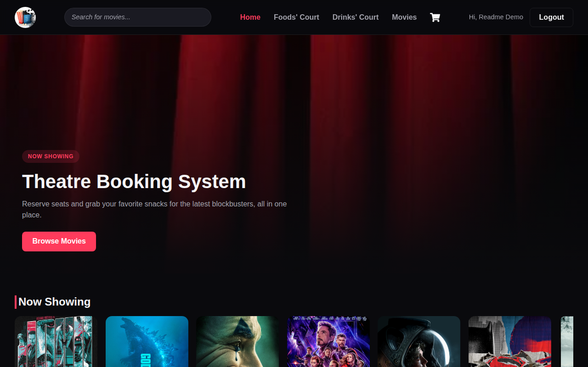
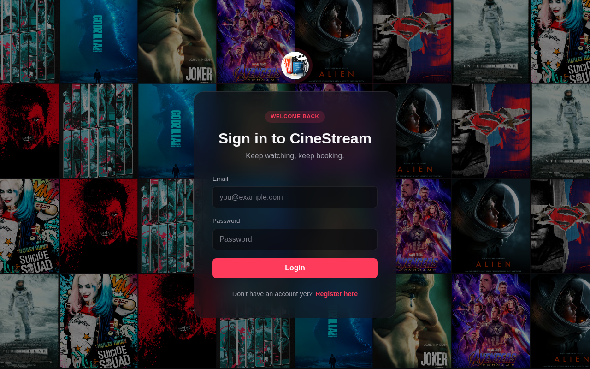
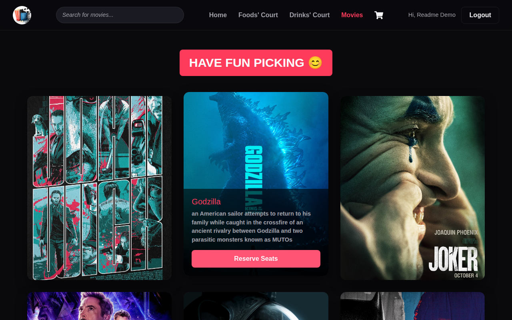
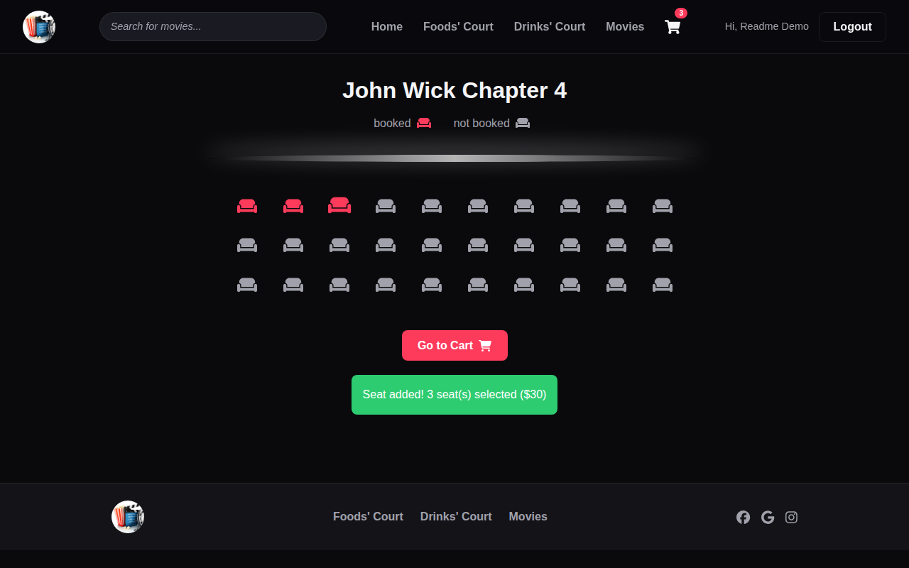
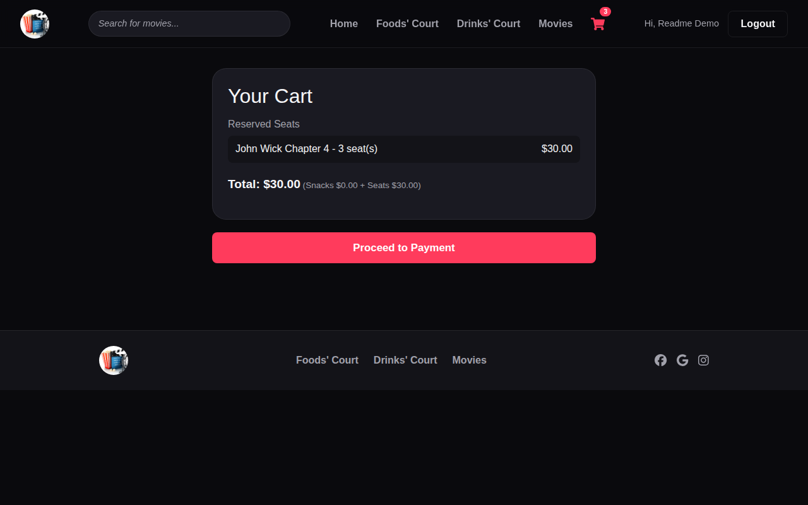

<div align="center">

# 🎬 CineStream

**Book the seat. Skip the line. Never miss the trailer.**

A modern, dark-themed movie ticket & seat booking experience — browse what's
playing, pick your seats on a live seat map, grab snacks on the way in, and
check out. All in one clean flow.

</div>

<p align="center">
  
</p>

---

## ✨ Features

- **Real movie data** — posters, ratings, genres and YouTube trailers pulled
  live from [TMDB](https://www.themoviedb.org/) (falls back to a small demo
  catalogue if no API key is configured).
- **Browse what's showing** — a scrollable "Now Showing" rail and full movie
  grid, each poster linking straight into booking.
- **Live seat map** — pick your exact seats per showtime, see running totals
  update instantly.
- **Snack Bar** — order popcorn, drinks, and combos alongside your tickets.
- **One cart, everything in it** — seats and snacks share a single cart with
  a running total, from any page.
- **Accounts that actually work** — register, log in, stay logged in per
  session; pages under `/home` are locked behind auth.
- **Demo checkout** — a clearly-labeled simulated payment flow (PayPal /
  card) so you can see the full journey end to end with zero real payment
  data involved.
- **Responsive, dark UI** — built around a poster-wall auth screen, a hero
  banner, and genre pills, tuned for desktop and mobile alike.

<p align="center">
  
</p>

## 🎟️ The flow

| Browse | Reserve Seats | Cart & Checkout |
| :---: | :---: | :---: |
|  |  |  |

## 🛠️ Tech stack

- **React 18** + **React Router 6**
- **Context API** for auth and cart state
- **Bootstrap 5** / **React-Bootstrap** for layout primitives
- **Font Awesome** + **react-icons** for iconography
- Zero backend — accounts and cart are stored client-side, hashed passwords
  included, so you can clone and run it in under a minute.

## 🚀 Getting started

```bash
git clone https://github.com/Mohammed-HeshamMohammed/Theatre-Movie-Booking.git
cd Theatre-Movie-Booking
npm install
npm start
```

Then open [http://localhost:3000](http://localhost:3000), create an account,
and start booking.

### Connecting real movie data (TMDB)

By default the app runs on a small bundled demo catalogue — no setup
required. To pull live posters, ratings, genres and trailers instead:

1. Create a free account at [themoviedb.org](https://www.themoviedb.org/)
   and grab your **API Key (v3 auth)** from Settings → API.
2. Copy `.env.example` to `.env` and paste it in:
   ```
   REACT_APP_TMDB_API_KEY=your_key_here
   ```
3. Restart `npm start`.

Deploying to Vercel (or another host)? Add the same
`REACT_APP_TMDB_API_KEY` under Project Settings → Environment Variables and
redeploy. If the key is missing or a request fails, the app silently falls
back to the demo catalogue instead of breaking.

This product uses the TMDB API but is not endorsed or certified by TMDB.

### Other scripts

```bash
npm run build   # production build in /build
npm test        # run the test suite
```

## 📂 Project structure

```
src/
├── component/     # Pages & UI components (Home, TheatreList, ReserveSeats, Cart, Auth...)
├── context/       # Auth, Cart, Movies & Sidebar UI state (global app state)
├── services/      # TMDB API client
├── css/           # Theme tokens + per-component styles
├── utils/         # Password hashing helper
└── TheatreData.js # Offline demo movies + food & drink catalogue
```

## ⚠️ Note on scope

This is a front-end demo project: there's no real backend, payment
processor, or database. Accounts and bookings live in the browser
(`localStorage`/`sessionStorage`), and checkout is fully simulated — don't
enter real payment details anywhere in the app.

---

<div align="center">

Built with React. Styled for the big screen.

</div>
